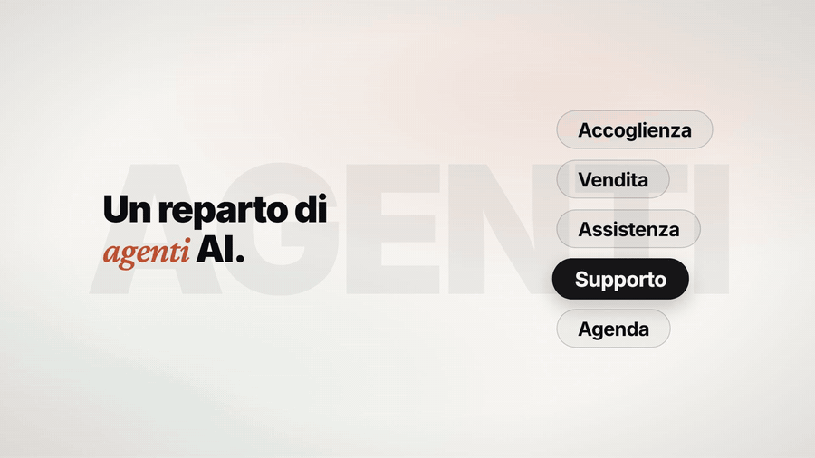
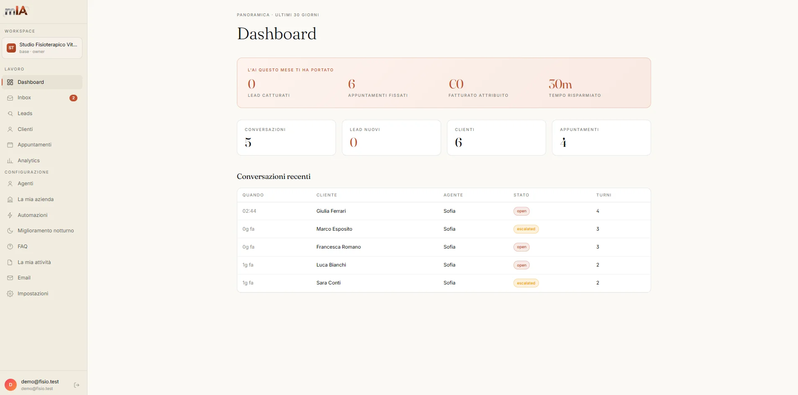
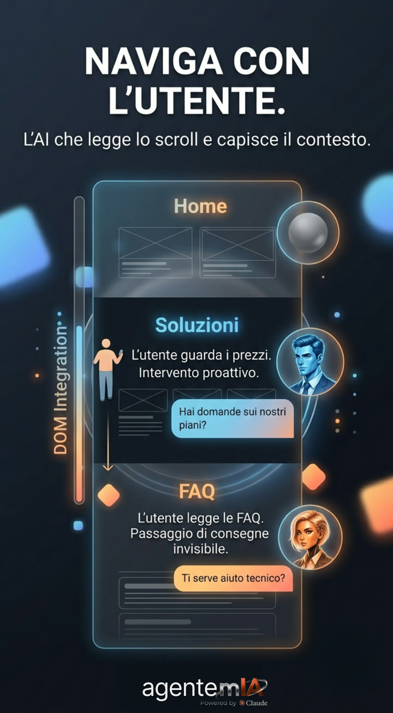
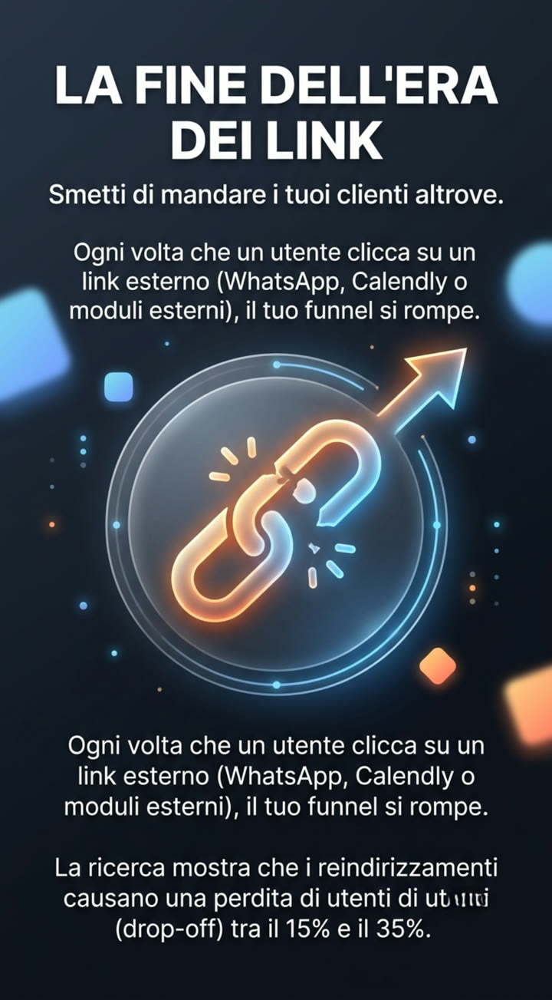
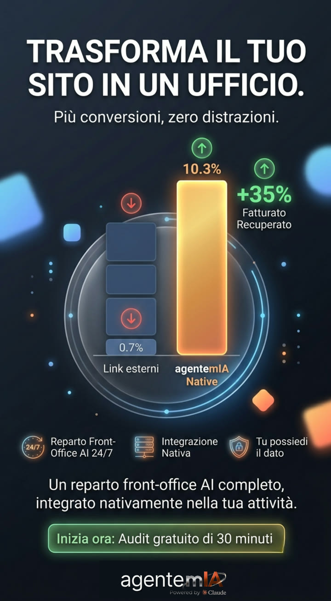

<strong>Italiano</strong> · <a href="README.en.md">English</a>

  

<h3 align="center">Il reparto front-office AI per la Sua attività</h3>

  <strong>Non è un chatbot.</strong> È un reparto: cinque agenti con un nome proprio che rispondono
  in chat sul Suo sito e al telefono sul Suo numero italiano, <strong>in tempo reale</strong>,
  giorno e notte, festivi compresi. Se non sanno, lo dicono — e passano a un umano.

  
  
  
  

  

Il widget sul sito di un cliente: domanda reale, analisi della richiesta, knowledge base del settore, proposta di appuntamento. In tempo reale.

---

## Perché esiste

Lo studio Harvard Business Review del 2011 e Drift hanno misurato la curva di decadimento
della conversione minuto per minuto: chi risponde tardi perde il contatto. La mediana delle
PMI italiane è **circa 277 minuti** alla prima risposta (Drift). In quelle ore il potenziale
cliente ha già scritto a qualcun altro.

agentemIA porta la prima risposta **al tempo reale** — chat, telefono e prenotazione —
senza assumere nessuno. Un impiegato vero costa €1.500–2.000 al mese in Italia.
Il reparto AI parte da €39.

Sulla landing c'è il [calcolatore](https://agentemia.it/#roi): tre numeri Suoi e vede
quanto fatturato Le sta scivolando addosso ogni anno.

---

## La Squadra AI — cinque agenti con un nome proprio

<table align="center">
<tr>
<td align="center" width="120"> <strong>Sofia</strong> Reception</td>
<td align="center" width="120"> <strong>Daniel</strong> Vendita</td>
<td align="center" width="120"> <strong>Lucia</strong> Care</td>
<td align="center" width="120"> <strong>Pablo</strong> Supporto Tecnico</td>
<td align="center" width="120"> <strong>Elena</strong> Agenda</td>
</tr>
</table>

| Agente | Ruolo | Cosa fa |
|--------|-------|---------|
| **Sofia** | Reception | Accoglienza e qualifica iniziale del contatto |
| **Daniel** | Vendita | Gestione lead, proposte commerciali e closing |
| **Lucia** | Care | Assistenza clienti e risoluzione problemi |
| **Pablo** | Supporto Tecnico | Risposte profonde basate sulla Sua documentazione (RAG) |
| **Elena** | Agenda | Prenota appuntamenti in tempo reale su Google/Outlook Calendar |

**Context Handoff nativo**: se l'utente scrolla sulla sezione prezzi, Sofia passa
silenziosamente il contesto a Daniel. Zero interruzioni, zero drop-off. Gli agenti parlano
**110 lingue** in modo nativo: riconoscono la lingua di chi scrive e rispondono nella stessa,
senza configurazioni e senza supplementi.

Tre parole d'ordine: **Velocità** (risposte in tempo reale), **Verticalità** (addestrati solo
sui Suoi documenti: FAQ, listini, perizie), **Verità** (zero allucinazioni: se non sa, dice
«non lo so» e passa a un umano).

---

## I tre canali

| Canale | Cosa fa |
|--------|---------|
| **Chat sul sito** | La Squadra AI brandizzata col Suo marchio, installata con una riga di codice. Ogni conversazione avviene nel Suo brand, non in un'app di terzi. |
| **Agente telefonico** | Risponde sul Suo numero italiano, giorno e notte, festivi compresi. Fatturazione al secondo, registrazione della chiamata, audio conservato in UE. |
| **Landing page** | La Sua pagina su misura, costruita e tenuta online da noi: dominio, hosting, certificato e modulo contatti collegato alla console. |

Chat e telefono arrivano nella **stessa inbox** della console. Su richiesta colleghiamo anche
canali aggiuntivi come WhatsApp e Facebook, sempre con inbox unica.

---

## La console — ogni conversazione, ogni costo, in tempo reale

  

Console operativa in italiano: funnel a **8 stati** (da nuovo lead a cliente), conversazioni
di tutti i canali in un'unica inbox, costi in tempo reale, agenda e knowledge base. Ogni notte
il **Miglioramento notturno** analizza i log e ottimizza gli agenti, senza intervento manuale.

E la console non è solo monitoraggio: installa **Dashboard Agents**, collaboratori AI
adattati alla Sua professione che conoscono documenti, processi e priorità e lavorano con Lei
sulle attività del giorno. Con la **Knowledge Factory**, i Suoi documenti diventano slide,
report, infografiche e cronologie in un clic (PPTX, DOCX, PNG).

---

## Le innovazioni che convertono

<table align="center">
<tr>
<td align="center" width="33%"></td>
<td align="center" width="33%"></td>
<td align="center" width="33%"></td>
</tr>
<tr>
<td align="center"><strong>Naviga con l'utente</strong> — il widget legge scroll, permanenza e sorgente (UTM) e interviene proattivo, prima della domanda.</td>
<td align="center"><strong>Zero drop-off</strong> — prenotazioni e moduli dentro la chat, con componenti interattivi. I redirect esterni perdono il 15–35% degli utenti.</td>
<td align="center"><strong>Il Suo marchio, non il loro</strong> — conversazione, script, infrastruttura e dato restano Suoi, dentro la Sua pagina.</td>
</tr>
</table>

---

## Speed-to-Lead — gli altri lavorano i clienti che Lei ha già. Noi glieli troviamo.

agentemIA non aspetta che i clienti bussino: individua le attività del Suo territorio che
hanno bisogno di Lei — il sito senza chat, le prenotazioni solo telefoniche, la risposta
lenta ai contatti — le ordina per probabilità di chiusura e Le consegna una **coda pronta
da contattare**.

---

## Come si parte

| Fase | Cosa succede |
|------|--------------|
| **1 · Analisi dell'impresa** | Audit gratuito di 30 minuti: capiamo processi, volumi e dove perde contatti. |
| **2 · Costruzione su misura** | Knowledge base dai Suoi documenti, agenti verticalizzati sul Suo settore. |
| **3 · Installazione** | Una riga di codice sul sito, numero telefonico attivo. Prima del go-live: stress-test antagonistico su 15 scenari critici del Suo settore. |
| **4 · Operativo** | Il reparto lavora 24/7. Lei guarda la console. |

---

## Prezzi — 12 prodotti, un listino solo

Come sulla [landing](https://agentemia.it/#prezzi): **scelga da dove parte, poi tre livelli.**
Il Front-office li mette insieme tutti — chat brandizzata, agente telefonico sul Suo numero
italiano e landing page su misura, in un canone solo. Se Le serve un pezzo soltanto, lo trova
qui sotto, allo stesso listino. Con l'annuale risparmia il **17%**.

### Front-office — tutto insieme, un canone solo

| Piano | Mensile | Con l'annuale | Voce inclusa | Dimensione |
|-------|---------|---------------|--------------|------------|
| **Front-office Base** | €109/mese | €91/mese | 300 minuti | ~100 chiamate da 3 min al mese |
| **Front-office Pro** | €199/mese | €166/mese | 650 minuti | ~215 chiamate da 3 min al mese |
| **Front-office Premium** | €429/mese | €358/mese | 1.200 minuti | ~400 chiamate da 3 min al mese |

Ogni piano include chat brandizzata (piano Squadra AI corrispondente), agente telefonico sul
Suo numero italiano e landing page su misura (realizzazione da €500). Oltre i minuti inclusi:
€0,135 al minuto. Un interlocutore, una fattura, una console — a meno della somma dei pezzi.

### Chat sul sito — la Squadra AI da sola

| Piano | Mensile | Con l'annuale |
|-------|---------|---------------|
| **Chat Base** | €59/mese | €49/mese |
| **Chat Pro** | €150/mese | €125/mese |
| **Chat Premium** | €420/mese | €350/mese |

Stesso piano chat che trova dentro il Front-office corrispondente. Conversazioni nella stessa
inbox della console.

### Agente telefonico — da solo

| Piano | Mensile | Con l'annuale | Dimensione |
|-------|---------|---------------|------------|
| **Voce 300 minuti** | €39/mese | €32/mese | ~100 chiamate da 3 min |
| **Voce 650 minuti** | €59/mese | €49/mese | ~215 chiamate da 3 min |
| **Voce 1.200 minuti** | €79/mese | €66/mese | ~400 chiamate da 3 min |

Risponde sul Suo numero italiano, festivi compresi. La voce si fattura **al secondo**, non a
scatti. Oltre i minuti inclusi: €0,135 al minuto su tutti i livelli.

### Servizi singoli

| Servizio | Prezzo | Note |
|----------|--------|------|
| **Landing page** | €59/mese (€49 con l'annuale) | Realizzazione €390 una tantum col primo canone. Dominio, hosting e certificato inclusi. 30 minuti di modifiche al mese. Se il canone si interrompe i file sono Suoi e glieli consegniamo. |
| **SEO · AEO** | €50/mese (€42 con l'annuale) | Profilo Google curato, attività leggibile e citabile dagli assistenti AI, pagine-risposta nel Suo settore. |
| **Integrazioni e agenti su misura** | Preventivo dopo l'audit gratuito | HubSpot, Pipedrive, il Suo gestionale. Agenti costruiti sul Suo mestiere. |

**Su ogni voce**: attivazione €0 (l'unica una tantum è la realizzazione della landing page).
Si paga con carta su Stripe. Si disdice quando vuole, senza penali, con export dei dati.

---

## Telefono contro telefono — il confronto sui listini pubblici

Il nostro agente telefonico da solo, contro chi vende il telefono e basta e contro una
segretaria in carne e ossa. Listini pubblici dei fornitori, aggiornati al 27 agosto 2026 —
i conti li facciamo con i numeri pubblicati dagli altri, non con i nostri. La tabella
completa è sulla [landing](https://agentemia.it/#confronto); l'essenziale:

| | agentemIA | Alternative AI | Segretaria remota |
|---|---|---|---|
| Copertura | 24/7 festivi inclusi | 24/7 | 7/7 ma 8:30–19:30 |
| Ingresso voce | **€39 / 300 min** | €29–39 per 100–250 min, o canone min. €250 | €35 / 44 min |
| Eccedenza | **€0,135/min** | €0,30–0,40/min | €0,59–0,79/min |
| Attivazione | **€0** | fino a €150 | €0 |
| Conteggio | **al secondo** | scatti da 15 s / n.d. | al secondo |
| Chat del sito nella stessa inbox | **Inclusa** | prodotto separato o assente | assente |
| Landing page e SEO·AEO | **Incluse nel listino** | assenti | assenti |
| Il servizio si ferma a soglia | **mai** | sì, finiti i crediti | a consumo |

---

## Si faccia raccomandare da ChatGPT, Gemini e Perplexity

I Suoi clienti ormai chiedono a un assistente AI «qual è il migliore nella mia zona». Se
l'AI non La conosce, consiglia un altro. Il servizio **SEO · AEO** rende la Sua attività
leggibile e citabile dai motori generativi: pagine-risposta nel Suo settore, accesso ai
motori, monitoraggio di come appare nelle risposte. Nell'audit gratuito Le mostriamo come
appare oggi.

---

## GDPR & Privacy

- Tutti i dati risiedono **nell'Unione Europea** — incluso l'audio delle chiamate
- Lei è Titolare del trattamento, agentemIA è il Responsabile
- Data Processing Agreement incluso, elenco pubblico dei sub-processor
- Abbonamento mensile **cancellabile in qualsiasi momento**: nessun vincolo, nessuna penale,
  export dei Suoi dati in archivio standard prima della cancellazione

---

## Domande frequenti

**In quante lingue parlano gli agenti?** 110, in modo nativo. Riconoscono la lingua di chi
scrive e rispondono nella stessa.

**Devo cambiare il mio sito?** No. Una riga di codice, nessun cambiamento alla Sua pagina.

**E se l'agente sbaglia una risposta?** Prima di ogni go-live: stress-test antagonistico su
15 scenari critici del Suo settore. Se non sa, dice «non lo so» e passa a un umano. Mai
citazioni inventate, mai promesse fuori scope.

**Posso provarlo senza impegno?** Sì: audit gratuito di 30 minuti, via WhatsApp o videocall.
Le diciamo se ha senso e come si configura. Se non procede, ha comunque capito cosa Le serve.

---

## Lo veda funzionare, adesso

Demo pubbliche della console, una per settore — dati dimostrativi, prodotto vero:

  
  
  
  

Oppure apra [agentemia.it](https://agentemia.it) e scriva a Sofia: il widget in basso a
destra è il prodotto.

  

Soluzioni già verticalizzate: [studi medici](https://agentemia.it/soluzioni/agente-ai-per-studi-medici/) ·
[studi legali](https://agentemia.it/soluzioni/agente-ai-per-studi-legali/) ·
[commercialisti](https://agentemia.it/soluzioni/agente-ai-per-commercialisti/) ·
[hotel](https://agentemia.it/soluzioni/agente-ai-per-hotel/) ·
[ristoranti](https://agentemia.it/soluzioni/agente-ai-per-ristoranti/) —
[tutte le soluzioni](https://agentemia.it/soluzioni/)

---

## Trenta minuti. Zero impegno.

Le rispondiamo entro un giorno lavorativo con due slot per la chiamata.

  
  
  

---

### Questa repository

Vetrina pubblica del brand: nessun file di codice, nessuna infrastruttura interna, nessun
segreto. Solo posizionamento, prodotto e listino — gli stessi di [agentemia.it](https://agentemia.it).

  <strong>agentemIA</strong> — Velocità · Verticalità · Verità 
  Il reparto front-office AI per la Sua attività · Made in EU · GDPR compliant 
  IA PER PROFESSIONISTI E IMPRESE

